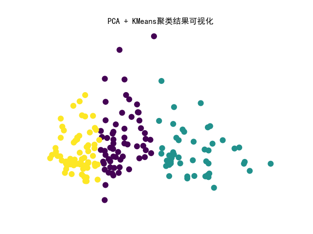
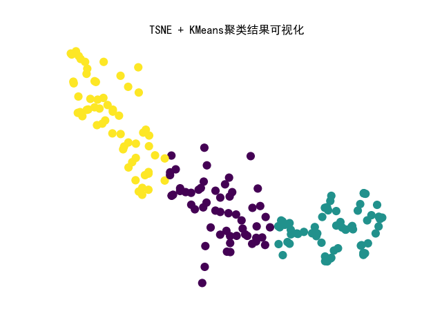
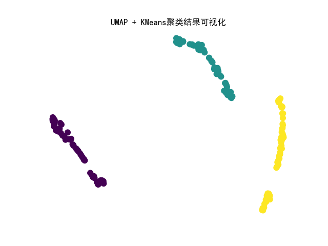

## 本仓库为数据挖掘课程的大作业

对数据集进行聚类分析，以及对于数据集的可视化展示

> 1.至少采用两种以上的算法针对相关数据进行分类、聚类、关联分析等挖掘，并给出实登对比与分折。
>
> 2.至少两个以上的数据集,其中一个要大于1000个样本。
>
> 3.给出数据来源、数据说明及数据的统计分析。若针对的是原始数据给出数甚便处理过程和方法，并提供相应的代码。
>
> 4.给出性能评价,给出可视化结果。
>
> 5.请提交完整python程序代码，并给出程序执行环境和视频操作执行说明。
>
> 6.作业叙述逻辑清楚,结果合理,图标标注规范，内容完整。

## python环境：

> python	3.8.13
>
> numpy	1.24.4
>
> scikit-learn	1.3.2
>
> scipy	1.10.1
>
> pandas	2.0.3

## 涉及到的数据集

* **MNIST**（手写数字）
  * 像素：24*24
  * 样本总数：7万
  * 训练集：6万
  * 测试机：1万
  * 数据集来源：[MNIST handwritten digit database, Yann LeCun, Corinna Cortes and Chris Burges](http://yann.lecun.com/exdb/mnist/)
* **wine**
  * 特征数：13
  * 类别数：3
  * 样本总数：178
  * 数据集来源：[Wine - UCI Machine Learning Repository](http://archive.ics.uci.edu/dataset/109/wine)

## 涉及的算法

* **Kmeans-聚类**
  * 使用的聚类算法为KMeans，KMeans是一种无监督学习算法。无监督学习是指在没有给定标签的情况下，从输入数据中学习模式或结构的机器学习任务。KMeans算法通过将数据点分组到K个集群中，其中每个数据点都属于最近的均值（即集群的中心）来学习数据的结构。
* **DBSCAN聚类**
  * DBSCAN（Density-Based Spatial Clustering of Applications with Noise）是一种基于密度的聚类算法，它能够发现任意形状的簇，并能够识别噪声点。DBSCAN的主要思想是基于样本点的密度来进行聚类，而不是像KMeans那样基于距离。

* **TSNE降维**
  * t-SNE（t-Distributed Stochastic Neighbor Embedding）是一种用于高维数据降维到低维的非线性方法。t-SNE主要用于可视化高维数据，尤其是在探索数据的局部结构时效果很好。其目标是在降维过程中保持相似性关系，即在高维空间中相似的点在低维空间中仍然保持相似。

* **PCA降维**
  * PCA 是一种线性降维技术，它通过找到数据中的主要方差方向（主成分），并将数据投影到这些主成分上来实现降维。主成分是数据中方差最大的方向，它们是数据中的线性组合。

* **UMAP降维**
  * UMAP 是一种非线性降维算法，它可以在保留数据的局部和全局结构的同时，对高维数据进行更灵活的降维。

## 涉及评测指标

* **聚类准确率acc**
* **AMI**
* **silhouette**
* **聚类结果可视化**（主观）

## 实验结果：

### 1. 对MNIST数据集进行降维前后的聚类分析

#### 1.1 数据加载

​	定义了一个读取 IDX 文件格式的函数 read_idx ，它可以读取包含图像或标签数据的文件。这些文件通常用于训练和测试机器学习模型。

#### 1.2 数据预处理

​	思路是从原始的训练集数据中，每个类别中选取随机的 100 张图像，总共**一千张**图像，并将它们与相应的标签合并到一起。步骤如下：

1. 对于每个数字类别，从原始训练集中随机选择 100 个图像，将它们和对应的标签添加到新的列表中。

2. 将新的图像和标签合并为一个数组。

3. 打乱训练集数据的顺序。

​	**进行图像的拉伸和归一化：**

1. 图像拉伸：原始图片为 28*28 的像素矩阵，使用 `np.reshape()` 函数将图像从 (1000, 28, 28) 拉伸为 (1000, 784)。
2. 归一化：将图像数据的每个像素值除以 255，将像素值缩放到 `0-1` 之间的范围内。这一步是为了提高训练的效率和精度，因为较小的输入数据通常会带来更好的性能表现。

#### 1.3 方法一：使用KMeans聚类

​	KMeans 算法的核心思想是将数据点分为 k 个簇，使得每个数据点都属于其中的一个簇，并且使得所有簇的中心点到其所属数据点的距离的平方和最小。

​	K 的选择对聚类的结果有很大的影响，通常可以用 `ElbowMethod `、`SilhouetteCoeff icientMethod` 等方法确定 K 值。对于 MNIST 数据集，分为 10 个簇，即 K=10。

​	首先对原始的 784 维图像进行 KMeans 聚类，分为以下两步：

1. 使用 `sklearn.cluster` 的 `KMeans()` 方法进行聚类，`n_clusters` 选择为 10。然后使用 `kmeans.fit` 进行拟合。
2. 将聚类结果转换为标签。在聚类中，每个样本被分配到不同的簇中，但是簇并没有一个实际的标签，因此需要将聚类结果转换为标签，以便可以对聚类算法的性能进行评估和比较。

**聚类结果**：

| 指标             | score |
| ---------------- | ----- |
| accuracy         | 0.486 |
| AMI              | 0.419 |
| silhouette score | 0.184 |

**结果可视化**：

​	使用散点图将聚类结果可视化。首先创建一个 10*10 大小的图像窗口，然后定义颜色列表 colors，用于为每个聚类结果分配不同的颜色。接着使用 `for` 循环遍历每个聚类结果，使用掩码数组 `mask` 来选择属于当前簇的样本，然后将这些样本的二维坐标绘制在散点图上，使用相应的颜色表示不同的聚类结果，并为每个聚类结果添加一个标签。

#### 1.4 方法二：先用TSNE降维后再KMeans聚类

​	在进行聚类之前，可以使用降维方法将数据从原始的 784 维度降低到更低的维度。通过减少特征的数量，可以提高聚类的效率，避免维度灾难，并提高聚类的准确性。

​	使用 TSNE 方法进行降维，将 784 维的数据降到 2 维，然后重复以上步骤，先用`KMeans` 方法进行聚类，再将聚类结果转换为标签。

**聚类结果**：

| 指标             | score |
| ---------------- | ----- |
| accuracy         | 0.563 |
| AMI              | 0.564 |
| silhouette score | 0.425 |

#### 1.5 方法三：使用DBSCAN聚类

​	DBSCAN 聚类方法是基于密度的聚类算法，与基于距离的 KMeans 算法不同，DBSCAN 不需要指定簇的数量，也不用将所有点都归入簇中，会自动识别出噪声点，将密度较高的点归为一类，密度较低的点被视为噪声。

**超参数的优化**：

​	`DBSCAN()` 有两个参数 `eps` 和 `min_samples` ，这两个参数很重要，决定了聚类的效果。`eps` 表示领域半径，即一个样本的领域范围，同一个簇的样本之间的距离不超过 `eps`。`min_samples` 表示领域内的最小样本数。

​	使用两个嵌套的 `for` 循环对 DBSCAN 聚类算法的两个参数 `eps` 和`min_samples` 进行遍历，先定义了 `eps` 和 `min_samples` 的取值范围。对于每个`min_samples` 的值，通过遍历 `eps_values` 来计算出相应的准确率`accuracy`，并保存下来。最终，将每个 `min_samples` 对应的 `eps` 和 `accuracy`的关系绘制成曲线图，便于直观地观察参数对聚类效果的影响。最后，选取使准确率最高的一组 `eps` 和 `min_samples` 作为最优参数来进行模型训练和预测。

​	

**超参数搜索过程如下**：

| 参数        | 最佳值 |
| ----------- | ------ |
| eps         | 6      |
| min_samples | 4      |

**聚类结果**：

| 指标             | score |
| ---------------- | ----- |
| accuracy         | 0.293 |
| AMI              | 0.306 |
| silhouette score | -0.02 |

**聚类结果可视化**：

#### 1.5 方法四：先用TSNE降维后使用DBSCAN聚类

思路方法三，在聚类前先使用TSNE降维。

**超参数搜索过程如下**：

| 参数        | 最佳值 |
| ----------- | ------ |
| eps         | 3      |
| min_samples | 9      |

**聚类结果**：

| 指标             | score |
| ---------------- | ----- |
| accuracy         | 0.713 |
| AMI              | 0.657 |
| silhouette score | 0.295 |

#### 1.6 实验结果对比分析

##### 1.6.1 TSNE降维前后KMeans聚类结果对比：

| 指标             | 降维前（784维） | 降维后 |
| ---------------- | --------------- | ------ |
| accuracy         | 0.486           | 0.563  |
| AMI              | 0.419           | 0.564  |
| silhouette score | 0.184           | 0.425  |

##### 1.6.2 TSNE降维前后DBSCAN聚类结果对比：

| 指标             | 降维前（784维） | 降维后 |
| ---------------- | --------------- | ------ |
| accuracy         | 0.293           | 0.713  |
| AMI              | 0.306           | 0.657  |
| silhouette score | -0.02           | 0.295  |

##### 1.6.3 实验结果分析

1. 从结果来看，TSNE 降维后的样本在使用 KMeans 和 DBSCAN 方法聚类的效果都比原始 784 维的样本要好。这说明在高维数据中，数据点之间的距离难以有效地区分不同类别的数据点，而降维可以使数据点的距离更好地反映它们之间的相似性。

2. 针对 MNIST 数据集，可以看到使用 KMeans 进行聚类的效果优于DBSCAN，尤其是在降维后的样本上。

3. 对于 DBSCAN 方法，使用参数搜索的方式进行超参数的选择可以进一步提高其聚类效果。但即使如此，DBSCAN 在 MNIST 聚类的表现不如 KMeans。
4. 聚类前使用 TSNE 对数据进行降维。在传统的聚类方法中，通常直接对原始数据进行聚类。但是，MNIST 数据集中的每张图片有 784 个像素，每张图片看作一个高维向量，直接对这些向量进行聚类难度较大。在维度过高的时候，如果采用常见的距离度量方法度量空间样本上的距离，就会陷入维度灾难，大部分样本间的距离会被压缩到很小的范围内，以致无法区分。因此，使用了 TSNE 算法将高维数据映射到二维空间中，从而更容易对数据进行可视化和聚类。

### 2. 对wine数据集进行不同降维方式后聚类分析

#### 2.1 方法一：PCA降维 + KMeans聚类

##### 2.1.1 PCA降维

​	PCA（Principal Component Analysis）是一种用于线性降维的方法。在wine数据集的上下文中，PCA可以用于将13个特征（酒的化学成分）降维到更少的维度，以便更容易进行可视化和聚类。PCA找到数据中的主成分，这些主成分是原始特征的线性组合，被排序以表示数据中的最大方差。

##### 2.1.1 聚类结果

| 指标             | score |
| ---------------- | ----- |
| accuracy         | 0.539 |
| AMI              | 0.422 |
| silhouette score | 0.572 |

##### 2.1.2 聚类结果可视化

#### 2.2 方法二：TSNE降维 + KMeans聚类

##### 2.2.2 聚类结果

| 指标             | score |
| ---------------- | ----- |
| accuracy         | 0.551 |
| AMI              | 0.379 |
| silhouette score | 0.619 |

##### 2.2.3 聚类结果可视化

#### 2.3 方法二：UMAP降维 + KMeans聚类

##### 2.3.1 UMAP降维

UMAP（Uniform Manifold Approximation and Projection）是一种非线性降维算法，它在保留数据的局部和全局结构方面表现出色。在wine数据集中，UMAP可以用于发现潜在的非线性关系和聚类结构，同时保留数据的高维特征。

##### 2.3.2 聚类结果

| 指标             | score |
| ---------------- | ----- |
| accuracy         | 0.056 |
| AMI              | 0.388 |
| silhouette score | 0.712 |

##### 2.3.3 聚类结果可视化

#### 2.4 实验结果对比分析

| 指标             | PCA降维 | TSNE降维 | UMAP降维 |
| ---------------- | ------- | -------- | -------- |
| accuracy         | 0.539   | 0.551    | 0.056    |
| AMI              | 0.422   | 0.379    | 0.388    |
| silhouette score | 0.572   | 0.619    | 0.712    |

​	不同降维方法在这个实验中表现出不同的优势。TSNE在准确度上稍微领先，UMAP在轮廓系数上表现最好。选择降维方法时，需要根据具体任务和数据特征来权衡各个指标。例如，如果聚类是主要目标，那么UMAP可能是更好的选择；如果准确度更为关键，那么TSNE可能更适合。
