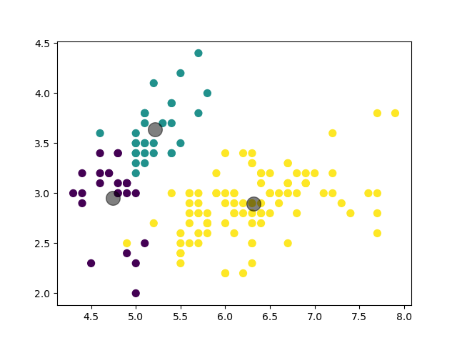

## 本仓库为数据挖掘课程的大作业

对数据集进行聚类分析，以及对于数据集的可视化展示

> 1.至少采用两种以上的算法针对相关数据进行分类、聚类、关联分析等挖掘，并给出实登对比与分折。
>
> 2.至少两个以上的数据集,其中一个要大于1000个样本。
>
> 3.给出数据来源、数据说明及数据的统计分析。若针对的是原始数据给出数甚便处理过程和方法，并提供相应的代码。
>
> 4.给出性能评价,给出可视化结果。
>
> 5.请提交完整python程序代码，并给出程序执行环境和视频操作执行说明。
>
> 6.作业叙述逻辑清楚,结果合理,图标标注规范，内容完整。

### python环境：

> python	3.8.13
>
> numpy	1.24.4
>
> scikit-learn	1.3.2
>
> scipy	1.10.1

### 涉及到的数据集

* iris
  * 特征数：4
  * 类别数：3
  * 样本总数：150
  * 数据集来源：[Iris - UCI Machine Learning Repository](http://archive.ics.uci.edu/dataset/53/iris)

### 涉及的算法

* Kmeans-聚类
  * 使用的聚类算法为KMeans，KMeans是一种无监督学习算法。无监督学习是指在没有给定标签的情况下，从输入数据中学习模式或结构的机器学习任务。KMeans算法通过将数据点分组到K个集群中，其中每个数据点都属于最近的均值（即集群的中心）来学习数据的结构。
* 

### 具体内容：

#### 1. 对iris数据集进行聚类分析

使用sklearn的库对iris数据集进行读取和聚类分析，分析出iris数据集中的类别

算法步骤：

1. 随机选择K个点作为初始的聚类中心
2. 对于数据集中的每个点，计算其到每个聚类中心的距离，并将其分配到最近的聚类中心
3. 更新每个聚类的中心点，使其成为该聚类所有点的平均值
4. 重复步骤2和3，直到聚类中心不再发生变化或达到预设的最大迭代次数

结果如下所示：

